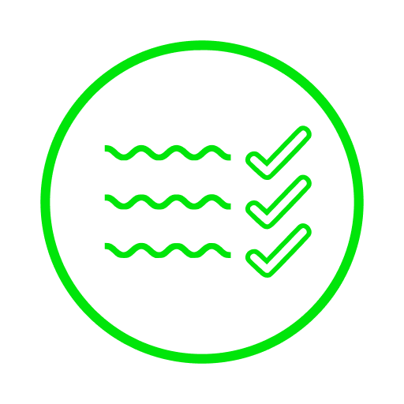

# Habit Tracker
 
## Идея
Это приложение на Flutter - трекер привычек. Мне показался неудобным интерфейс других приложений для отслеживания прогресса в привычках, поэтому я разраюотала боле удобный для меня интерфейс и создала приложение.

## Технологии
 - Firebase Auth
 - Redux
 - FireStore (?)
 - Custom Widgets: CheckBox, Calendar
 - Animation (?)
 - Google Fonts & Image assets
 - Navigation
 - Tests (?)
 - Localization (?)
 - Github Workflows

## Дизайн
https://www.figma.com/file/nAue6tugPgw3SKicPyvbu9/Untitled?node-id=63%3A217

## Доска задач
https://trello.com/invite/b/I5kgthHa/fc4d1df9f860eac3de6611ebb2d1ce32/month-tracker

## Главные экраны и сценарии

## Текущая версия
Текущую версию можно найти так: Actions -> Самая последняя удачная версия (с галочкой) -> Artifacts. Скачать архив, распаковать, установить.
